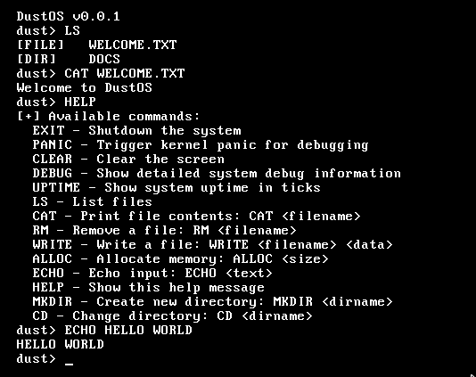

### ⚠️ Still in development! ⚠️ 



# DustOS

DustOS is my first attempt of making an operating system. 

The aim of this operating system is to help me get a better understading on low level programming.

A lot of code in this repository I have not written my self as I am lazy..

I have linked below the repo/s that I have used code from/or have taken inspiration from:

- https://github.com/FRosner/FrOS
- https://github.com/cia-foundation/TempleOS
- https://github.com/joexbayer/RetrOS-32
- https://github.com/cfenollosa/os-tutorial

I have modified some files to my own liking and used the OSDev wiki as guidance.

### Features
Currently, DustOS targets works on i386 BIOS.

It has no userspace, meaning you operate in ring 0 at all times. 

The filesystem is stored in RAM, there is currently no writing to disk functionality yet.

The most you can do is make directories and write/read text files.

## Contributing

If you would like to contribute to this project, please feel free to submit a pull request and I will try to merge it.

I would really appreciate any help or suggestions. 

Thanks to all contributors.

## Usage
### Prerequisites

The Makefile relies on these programs:
```
i386-elf-gcc
i386-elf-ld
i386-elf-gdb
nasm
ndisasm
qemu-system-i386
xxd
```

### Installation and running
To install: ``` git clone https://github.com/zzhjf8/DustOS.git ```

Next, change directory into the DustOS/ folder you cloned.

To run: ``` make ```

To debug: ``` make debug ```  or  ``` make echo ```

To clean: ``` make clean ```
